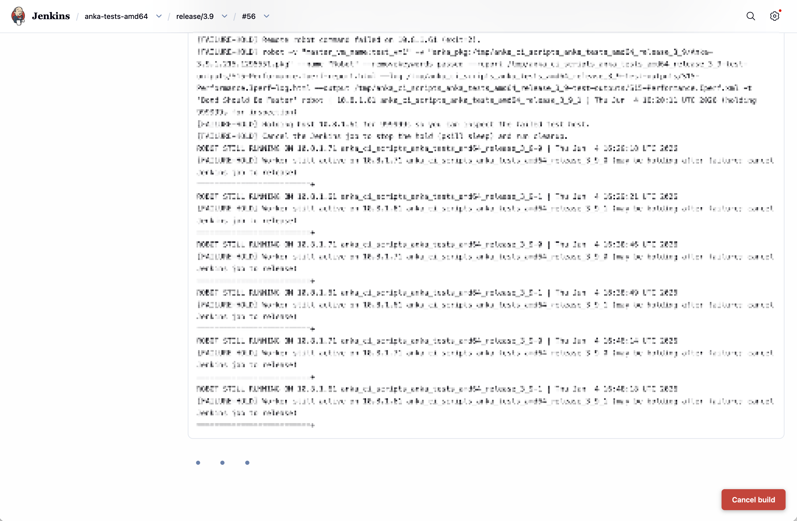

# Console Cancel Button (Jenkins plugin)

Adds a fixed **Cancel build** button to the bottom-right of build *console*
pages. The button appears only while the build is running, asks for
confirmation, and then gracefully aborts the build (the same action as the red
X in the Jenkins UI).




## Development

### Requirements

- **Runtime:** Jenkins 2.528.3 or newer (see `jenkins.baseline` in `pom.xml`).
- **Build:** JDK **21** (required by the Jenkins plugin parent POM 6.x) and Maven 3.9.6+ (Maven 4 works too).

Run Maven on JDK 21. **Do not use JDK 11** or **JDK 24+** for local builds (see troubleshooting).

#### Set `JAVA_HOME` first

macOS (Homebrew OpenJDK 21):

```bash
export JAVA_HOME=/Library/Java/JavaVirtualMachines/openjdk-21.jdk/Contents/Home
export PATH="$JAVA_HOME/bin:$PATH"
java -version   # should report 21
```

If you use [jenv](https://github.com/jenv/jenv) or [asdf](https://asdf-vm.com/),
the repo includes `.java-version` (`21`).

The repo includes `.mvn/maven.config` so Maven 4 can resolve artifacts from
`repo.jenkins-ci.org` (no extra flags needed).

### Build and test

**Easiest on macOS:** use `./mvnw` — it picks Homebrew JDK 21 or 17 when `JAVA_HOME`
is unset (avoids the JDK 11 / JDK 24 failures below).

```bash
chmod +x mvnw   # once
./mvnw clean package
```

Or set `JAVA_HOME` yourself (same JDK as [CI](.github/workflows/ci.yml), Temurin 21),
then run `mvn`:

Full build with tests:

```bash
mvn clean package
```

Build the `.hpi` without running tests (faster iteration):

```bash
mvn -DskipTests package
```

Run tests only:

```bash
mvn test
```

Run a single test class:

```bash
mvn -Dtest=CancelButtonPageDecoratorTest test
```

#### Troubleshooting

| Symptom | Likely cause | Fix |
|--------|----------------|-----|
| `Unsupported class file major version 70` during `license:process` | Maven is running on **JDK 24+** | `export JAVA_HOME` to JDK 17, 21, or 22 (see above) |
| Log shows `java-level/11` and `release 11` | Maven is running on **JDK 11** | Same: use JDK 17–22 |
| `Unable to locate a Java Runtime` | No JDK on `PATH` | Set `JAVA_HOME` and add `$JAVA_HOME/bin` to `PATH` |
| Tests pass but `BUILD FAILURE` at license step | Wrong JDK for Maven itself, not the compiler flag in `pom.xml` | Verify with `java -version` in the **same shell** as `mvn` |

The installable plugin is written to `target/jenkins-console-cancel-button.hpi`. The
first build downloads the Jenkins parent POM, core, and test harness from
`repo.jenkins-ci.org` and may take a few minutes.

### Continuous integration

- GitHub Actions runs `mvn clean package` on every push and pull request (see
  [`.github/workflows/ci.yml`](.github/workflows/ci.yml)).
- [ci.jenkins.io](https://ci.jenkins.io/) builds via [`Jenkinsfile`](Jenkinsfile) after the plugin is hosted under `jenkinsci`.

## Install

1. Install from the Jenkins plugin catalog (after hosting), or upload a built `.hpi`.
2. In Jenkins: **Manage Jenkins → Plugins → Advanced settings → Deploy Plugin**.
3. Upload `target/jenkins-console-cancel-button.hpi`.
4. Restart Jenkins when prompted.

## How it works

A `PageDecorator` injects a small script into every page footer. The script
does nothing unless the page URL ends in `/console` or `/consoleFull`. On a
console page it polls the build's `api/json` for `building` status; while the
build runs it shows the fixed cancel button. Clicking it POSTs to the build's
`stop` endpoint with a CSRF crumb.
